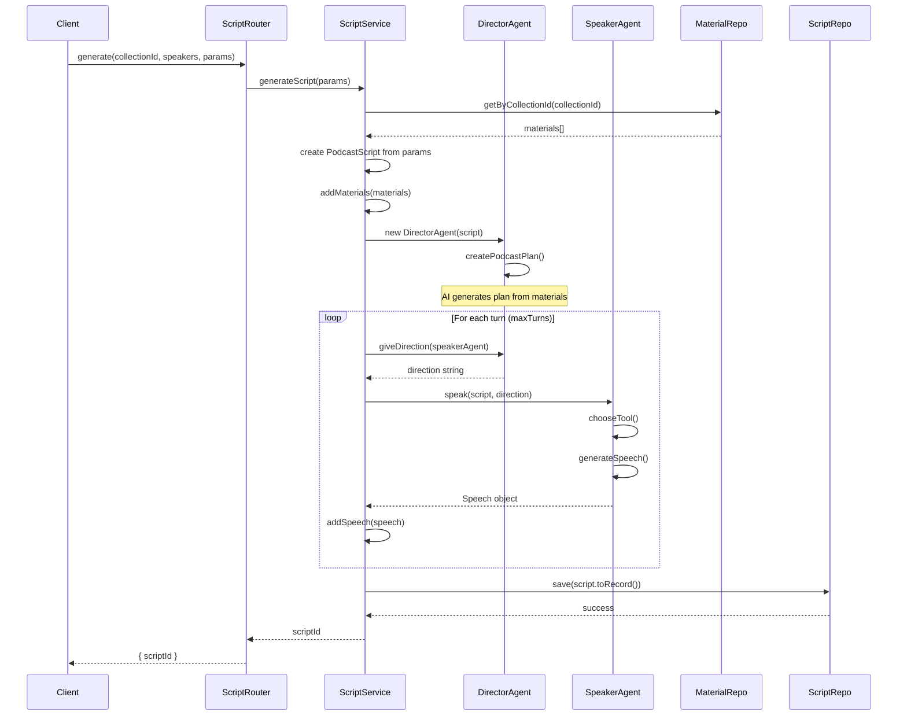
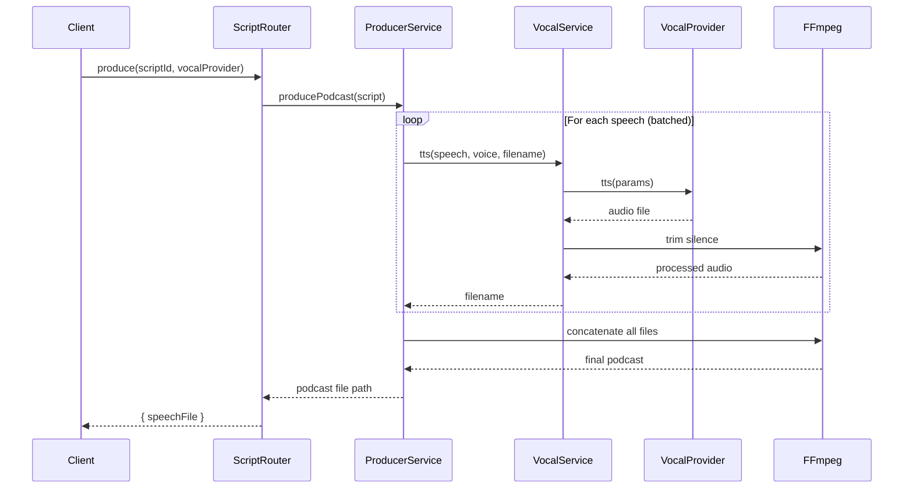
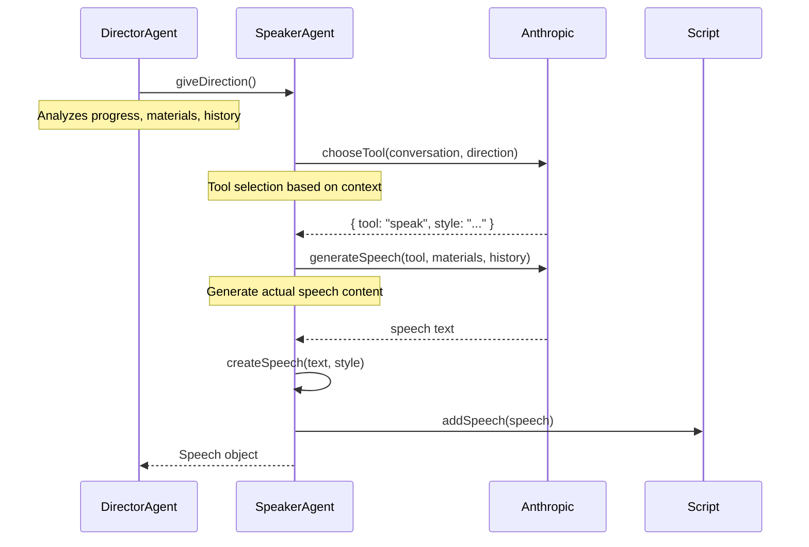
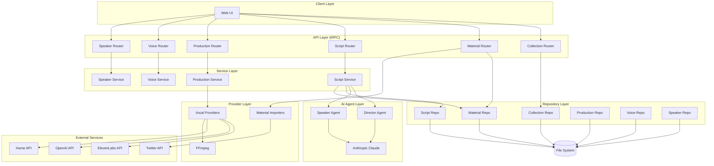

# Backend Implementation Report: Tweedy Podcast Generation System

## Overview

The Tweedy backend is a sophisticated podcast generation system built with TypeScript, Next.js, and tRPC. It implements a clean architecture with clear separation of concerns, dependency injection, and comprehensive tyspe safety. The system generates AI-powered podcast scripts and produces audio using multiple text-to-speech providers.

## Architecture Overview

The backend follows a layered architecture pattern:

```
┌─────────────────────────────────────┐
│           API Layer (tRPC)          │
├─────────────────────────────────────┤
│         Service Layer               │
├─────────────────────────────────────┤
│       Repository Layer              │
├─────────────────────────────────────┤
│        Provider Layer               │
└─────────────────────────────────────┘
```

## Key System Flows

### 1. Podcast Script Generation Flow



### 2. Audio Production Flow



### 3. Speaker Agent Decision Flow



### 4. Overall System Architecture Flow



## Core Interfaces and Abstractions

### 1. Repository Pattern

The system implements a comprehensive repository pattern with a base abstract class and specific implementations:

#### `FileBaseRepository<T>` (Abstract Base)

```typescript
export abstract class FileBaseRepository<T> {
  protected abstract getCollectionPath(): string;
  protected abstract getRecordPath(id: string): string;

  protected async ensureCollectionDirectory(): Promise<void>;
  protected async getRecord(id: string): Promise<T | null>;
  protected async saveRecord(id: string, record: T): Promise<void>;
  protected async deleteRecord(id: string): Promise<void>;
  protected async getAllRecords(): Promise<T[]>;
}
```

**Key Features:**

- Generic type parameter for type safety
- Abstract methods for path configuration
- Common CRUD operations
- File system abstraction
- Error handling for missing files

#### Repository Interfaces

**`ICollectionRepository`**

```typescript
export interface ICollectionRepository {
  create(
    collection: Omit<CollectionRecord, "id" | "createdAt" | "updatedAt">
  ): Promise<CollectionRecord>;
  getById(id: string): Promise<CollectionRecord | null>;
  getAll(): Promise<CollectionRecord[]>;
  update(
    id: string,
    collection: Partial<
      Omit<CollectionRecord, "id" | "createdAt" | "updatedAt">
    >
  ): Promise<CollectionRecord | null>;
  delete(id: string): Promise<boolean>;
  findByName(name: string): Promise<CollectionRecord | null>;
}
```

**`IPodcastMaterialRepository`**

```typescript
export interface IPodcastMaterialRepository {
  insert(material: Omit<PodcastMaterialRecord, "id">): Promise<string>;
  getByCollectionId(collectionId: string): Promise<PodcastMaterialRecord[]>;
  getAll(): Promise<PodcastMaterialRecord[]>;
}
```

**`ISpeakerRepository`**

```typescript
export interface ISpeakerRepository {
  create(speaker: SpeakerRecord): Promise<SpeakerRecord>;
  getById(id: string): Promise<SpeakerRecord>;
  getAll(): Promise<SpeakerRecord[]>;
  update(speaker: SpeakerRecord): Promise<void>;
  delete(id: string): Promise<void>;
}
```

### 2. Service Layer Interfaces

#### `ISpeakerService`

```typescript
export interface ISpeakerService {
  createSpeaker(speaker: CreateSpeakerDTO): Promise<Speaker>;
  getSpeaker(id: string): Promise<Speaker>;
  getAllSpeakers(): Promise<Speaker[]>;
  updateSpeaker(speaker: UpdateSpeakerDTO): Promise<Speaker>;
  deleteSpeaker(id: string): Promise<void>;
}
```

**Key Features:**

- DTO-based input/output
- Voice population logic
- Error handling for missing voices
- Type-safe operations

#### `IScriptService`

```typescript
export interface IScriptService {
  addMaterial(material: Omit<PodcastMaterial, "id">): Promise<string>;
  getMaterialsByCollectionId(collectionId: string): Promise<PodcastMaterial[]>;
  generateScript(params: GenerateScriptParams): Promise<PodcastScriptRecord>;
  getScript(scriptId: string): Promise<PodcastScript>;
}
```

#### `IPodcastProductionService`

```typescript
export interface IPodcastProductionService {
  createProduction(
    scriptId: string,
    voiceProvider: VocalProviderName
  ): Promise<Production>;
  getProduction(id: string): Promise<Production>;
  getAllProductions(): Promise<Production[]>;
  getProductionsByScriptId(scriptId: string): Promise<Production[]>;
  updateProductionStatus(
    id: string,
    status: ProductionStatus,
    errorMessage?: string
  ): Promise<void>;
  updateProductionAudioUrl(id: string, audioUrl: string): Promise<void>;
  deleteProduction(id: string): Promise<void>;
}
```

### 3. Provider Pattern

#### `IVocalProvider` (Text-to-Speech)

```typescript
export interface IVocalProvider {
  tts(params: VocalProviderTtsParams): Promise<string>;
}

export type VocalProviderTtsParams = {
  speech: Speech;
  voice: Voice;
  outputFileName: string;
};
```

**Implementations:**

- `ElevenLabsVocalProvider`
- `OpenAIVocalProvider`
- `HumeVocalProvider`

**Provider Factory:**

```typescript
export function getVocalProvider(provider: VocalProviderName): IVocalProvider {
  switch (provider) {
    case VocalProviderName.ElevenLabs:
      return new ElevenLabsVocalProvider();
    case VocalProviderName.OpenAI:
      return new OpenAIVocalProvider();
    case VocalProviderName.Hume:
      return new HumeVocalProvider();
  }
}
```

#### `IMaterialImporter<T>`

```typescript
export interface IMaterialImporter<T> {
  importMaterials(collectionId: string, subject?: T): Promise<string>;
}
```

**Implementations:**

- `ClaudeMaterialImporter`
- `TwitterMaterialImporter`

### 4. AI Agent Interfaces

#### `ISpeakerAgent`

```typescript
export interface ISpeakerAgent {
  speak(podcastScript: PodcastScript, direction: string): Promise<Speech>;
}
```

**Implementation: `SpeakerAgent`**

- Tool-based conversation system
- Multiple speech types (speak, interject, one-liner, etc.)
- Expert vs. non-expert behavior
- Retry logic with fallback responses

#### `DirectorAgent`

- Manages podcast flow and timing
- Provides direction to speakers
- Handles completion logic
- Material-aware planning

### 5. Core Domain Models

#### `PodcastScript` (Domain Entity)

```typescript
export class PodcastScript {
  private readonly config: GenerateScriptParams;
  public readonly speeches: Speech[];
  public readonly materials: PodcastMaterial[];
  private readonly id: string;

  // Business logic methods
  addSpeech(speech: Speech): void;
  addMaterial(material: PodcastMaterial): void;
  get percentComplete(): number;
  get maxTurns(): number;
  get turnsLeft(): number;

  // Data transformation
  toRecord(): PodcastScriptRecord;
  toDTO(): PodcastScriptDTO;
}
```

#### Type Definitions

**Core Enums:**

```typescript
export enum SourceType {
  Twitter = "twitter",
  Manual = "manual",
  Claude = "claude",
}

export enum SpeakerAllocation {
  Random = "random",
  Sequential = "sequential",
  Managed = "managed",
}

export enum VocalProviderName {
  ElevenLabs = "elevenlabs",
  OpenAI = "openai",
  Hume = "hume",
}

export enum ProductionStatus {
  Pending = "pending",
  Processing = "processing",
  Completed = "completed",
  Error = "error",
}
```

**Core Types:**

```typescript
export interface Voice {
  id: string;
  voiceName: string;
  voiceDescription: string;
  elevenLabsId: string;
  openAiId: string;
  humeId: string;
  openAiOptions: { defaultInstructions: string };
  elevenLabsOptions: { stability: number; similarity_boost: number };
  humeOptions: { defaultInstructions: string };
}

export interface Speaker {
  id: string;
  name: string;
  personality: string;
  voice: Voice;
  voiceStyle: string;
  isExpert: boolean;
}

export interface Speech {
  speaker: Speaker;
  message: string;
  instructions: string;
  voice: Voice;
  voiceStyle: string;
}
```

## API Layer (tRPC)

### Router Structure

```typescript
export const appRouter = createTRPCRouter({
  post: postRouter,
  speaker: speakerRouter,
  script: scriptRouter,
  voice: voiceRouter,
  twitter: twitterRouter,
  collection: collectionRouter,
  production: productionRouter,
  material: materialRouter,
});
```

### Router Implementation Pattern

Each router follows a consistent pattern:

```typescript
export const collectionRouter = createTRPCRouter({
  getAll: publicProcedure.query(async () => {
    return await collectionRepository.getAll();
  }),

  getById: publicProcedure
    .input(z.object({ id: z.string() }))
    .query(async ({ input }) => {
      const collection = await collectionRepository.getById(input.id);
      if (!collection) {
        throw new Error(`Collection with id ${input.id} not found`);
      }
      return collection;
    }),

  create: publicProcedure
    .input(
      z.object({
        name: z.string().min(1),
        description: z.string().optional(),
      })
    )
    .mutation(async ({ input }) => {
      return await collectionRepository.create({
        name: input.name,
        description: input.description ?? "",
      });
    }),
});
```

### Error Handling

- Consistent error throwing with descriptive messages
- tRPC error formatting with Zod validation
- Service layer error propagation

## Key Algorithms and Pseudocode

### 1. Script Generation Algorithm

```pseudocode
FUNCTION generateScript(params: GenerateScriptParams):
    // Initialize script with parameters
    script = PodcastScript.fromGenerateScriptParams(params)

    // Load materials for the collection
    materials = materialRepository.getByCollectionId(params.collectionId)
    FOR EACH material IN materials:
        script.addMaterial(material)

    // Create director agent and generate plan
    director = new DirectorAgent(script)
    plan = await director.createPodcastPlan()

    // Generate script through conversation
    currentSpeakerIndex = 0
    FOR turn = 0 TO params.maxTurns:
        speakerConfig = params.speakerConfigs[currentSpeakerIndex]
        speakerAgent = new SpeakerAgent(speakerConfig)

        // Get direction from director
        direction = await director.giveDirection(speakerAgent)

        // Generate speech using AI agent
        speech = await speakerAgent.speak(script, direction)
        script.addSpeech(speech)

        // Rotate to next speaker
        currentSpeakerIndex = (currentSpeakerIndex + 1) % params.speakerConfigs.length

    // Save completed script
    scriptRepository.save(script.toRecord())
    RETURN script.toRecord()
END FUNCTION
```

### 2. Speaker Agent Decision Algorithm

```pseudocode
FUNCTION speak(script: PodcastScript, direction: string):
    attempts = 0
    maxAttempts = 4

    WHILE attempts < maxAttempts:
        TRY:
            // Step 1: Choose appropriate tool
            toolChoice = await chooseTool(script, direction)
            // Returns: { tool: SpeakerAgentTool, style: string }

            // Step 2: Generate speech content
            speechContent = await generateSpeech(
                toolChoice.tool,
                toolChoice.style,
                script,
                direction
            )
            // Returns: { speechText: string, style: string }

            // Step 3: Create speech object
            speech = createSpeech(speechContent.speechText, speechContent.style)
            script.addSpeech(speech)

            RETURN speech

        CATCH error:
            attempts++
            IF attempts == maxAttempts:
                // Fallback response
                fallbackSpeech = createSpeech(
                    "Sorry, my mind wandered for a moment. What was the question?",
                    "Say this with a confused tone"
                )
                script.addSpeech(fallbackSpeech)
                RETURN fallbackSpeech
            END IF
        END TRY
    END WHILE
END FUNCTION

FUNCTION chooseTool(script: PodcastScript, direction: string):
    // Build conversation context
    messages = [
        initialMessage(script),
        ...speechesToMessages(script.speeches),
        { role: "user", content: `Director says: "${direction}"` }
    ]

    // Call AI to select tool
    response = anthropic.messages.create({
        model: "claude-3-5-sonnet-latest",
        messages: messages,
        tools: speakerAgentToolList,
        tool_choice: { type: "any" }
    })

    toolCall = response.content.find(content => content.type === "tool_use")
    tool = speakerAgentToolList.find(t => t.name === toolCall.name)

    RETURN { tool: tool, style: toolCall.input.style }
END FUNCTION
```

### 3. Audio Production Algorithm

```pseudocode
FUNCTION producePodcast(script: PodcastScript):
    speechFileNames = []
    batchSize = 3

    // Process speeches in batches for efficiency
    FOR i = 0 TO script.speeches.length STEP batchSize:
        batch = script.speeches.slice(i, i + batchSize)

        // Generate audio for batch in parallel
        batchPromises = []
        FOR EACH speech IN batch:
            promise = vocalService.tts({
                speech: speech,
                voice: speech.voice,
                outputFileName: generateId() + ".mp3"
            })
            batchPromises.add(promise)
        END FOR

        batchResults = await Promise.all(batchPromises)
        speechFileNames.addAll(batchResults)
    END FOR

    // Create concatenation list for FFmpeg
    listFile = createTempFile()
    FOR EACH filename IN speechFileNames:
        writeLine(listFile, "file 'speeches/" + filename + "'")
    END FOR

    // Concatenate all audio files
    outputFile = "podcasts/podcast-" + generateId() + ".mp3"
    await ffmpegConcat(listFile, outputFile)

    // Cleanup
    deleteFile(listFile)

    RETURN relativePath(outputFile)
END FUNCTION

FUNCTION ffmpegConcat(listFile: string, outputFile: string):
    ffmpeg()
        .input(listFile)
        .inputOptions(['-f concat', '-safe 0'])
        .outputOptions([
            '-af', 'loudnorm=I=-16:LRA=11:TP=-1.5',  // Normalize audio
            '-af', 'silenceremove=1:0:-50dB:1:0:-50dB'  // Remove silence
        ])
        .output(outputFile)
        .run()
END FUNCTION
```

### 4. Director Agent Planning Algorithm

```pseudocode
FUNCTION createPodcastPlan():
    // Analyze materials and create plan
    materialText = ""
    FOR EACH material IN script.materials:
        materialText += material.notes + ": " + material.text + "\n"
    END FOR

    messages = [
        { role: "user", content: script.directorInstructions },
        { role: "user", content: "Create a plan for this audio production of about " + script.maxSeconds + " seconds" },
        { role: "user", content: "The material is: " + materialText }
    ]

    response = anthropic.messages.create({
        model: "claude-3-7-sonnet-latest",
        messages: messages,
        max_tokens: 500
    })

    plan = response.content[0].text
    this.podcastPlan = plan
END FUNCTION

FUNCTION giveDirection(speakerAgent: SpeakerAgent):
    // Build context for direction
    progress = script.percentComplete
    history = script.speeches.map(s => s.speaker.name + ": " + s.message)

    messages = [
        { role: "user", content: "You are the director of an audio production..." },
        { role: "user", content: "The plan for this audio production is: " + this.podcastPlan },
        { role: "user", content: "We are " + progress + "% complete. Speakers have discussed: " + history.join("\n") }
    ]

    // Add expert-specific or general direction
    IF speakerAgent.isExpert:
        messages.add({ role: "user", content: "What should " + speakerAgent.name + " focus on? Start with 'You should...'" })
    ELSE:
        messages.add({ role: "user", content: "Give vague direction to " + speakerAgent.name + ". Start with 'You should...'" })
    END IF

    // Handle time constraints
    IF script.turnsLeft <= 1:
        messages.add({ role: "user", content: script.directorInstructionsOnDone })
    ELSE IF script.secondsLeft < 3:
        messages.add({ role: "user", content: script.directorInstructionsOnNearlyDone })
    END IF

    response = anthropic.messages.create({
        model: "claude-3-7-sonnet-latest",
        messages: messages,
        max_tokens: 300
    })

    RETURN response.content[0].text
END FUNCTION
```

### 5. Repository Pattern Implementation

```pseudocode
ABSTRACT CLASS FileBaseRepository<T>:
    // Abstract methods to be implemented by subclasses
    ABSTRACT FUNCTION getCollectionPath(): string
    ABSTRACT FUNCTION getRecordPath(id: string): string

    // Common file operations
    FUNCTION ensureCollectionDirectory():
        path = getCollectionPath()
        createDirectory(path, recursive: true)
    END FUNCTION

    FUNCTION getRecord(id: string): T | null:
        TRY:
            path = getRecordPath(id)
            data = readFile(path, encoding: 'utf-8')
            RETURN JSON.parse(data) as T
        CATCH:
            RETURN null
        END TRY
    END FUNCTION

    FUNCTION saveRecord(id: string, record: T):
        ensureCollectionDirectory()
        path = getRecordPath(id)
        writeFile(path, JSON.stringify(record, null, 2))
    END FUNCTION

    FUNCTION getAllRecords(): T[]:
        TRY:
            path = getCollectionPath()
            files = readDirectory(path)
            records = []

            FOR EACH file IN files:
                IF file.endsWith('.json'):
                    data = readFile(path + "/" + file, encoding: 'utf-8')
                    records.add(JSON.parse(data) as T)
                END IF
            END FOR

            RETURN records
        CATCH:
            RETURN []
        END TRY
    END FUNCTION
END CLASS
```

## Service Implementations

### `ScriptService`

```typescript
export class ScriptService implements IScriptService {
  constructor(
    private readonly podcastScriptRepository: PodcastScriptRepository,
    private readonly podcastMaterialRepository: PodcastMaterialRepository
  ) {}

  async generateScript(
    params: GenerateScriptParams
  ): Promise<PodcastScriptRecord> {
    const podcastScript = PodcastScript.fromGenerateScriptParams(params);
    const materials = await this.podcastMaterialRepository.getByCollectionId(
      params.collectionId
    );

    materials.forEach((material) => podcastScript.addMaterial(material));

    const directorAgent = new DirectorAgent(podcastScript);
    await directorAgent.createPodcastPlan();

    // Generate script with AI agents
    for (let i = 0; i < maxTurns; i++) {
      const speakerConfig = params.speakerConfigs[currentSpeakerIndex];
      const speakerAgent = new SpeakerAgent(speakerConfig);
      const direction = await directorAgent.giveDirection(speakerAgent);
      await speakerAgent.speak(podcastScript, direction);
      currentSpeakerIndex =
        (currentSpeakerIndex + 1) % params.speakerConfigs.length;
    }

    await this.podcastScriptRepository.save(podcastScript.toRecord());
    return podcastScript.toRecord();
  }
}
```

### `SpeakerService`

```typescript
export class SpeakerService implements ISpeakerService {
  constructor(
    private readonly speakerRepository: SpeakerRepository,
    private readonly voiceRepository: VoiceRepository
  ) {}

  private async populateSpeakerWithVoice(
    speaker: Omit<Speaker, "voice"> & { voiceId: string }
  ): Promise<Speaker> {
    const voice = await this.voiceRepository.getById(speaker.voiceId);
    return {
      id: speaker.id,
      name: speaker.name,
      personality: speaker.personality,
      voice,
      voiceStyle: speaker.voiceStyle,
      isExpert: speaker.isExpert,
    };
  }
}
```

## AI Agent System

### `SpeakerAgent` Implementation

```typescript
export class SpeakerAgent implements SpeakerAgent {
  private readonly client: Anthropic;

  // Tool-based conversation system
  private async chooseTool(
    podcastScript: PodcastScript,
    direction: string
  ): Promise<{ tool: SpeakerAgentTool; style: string }>;
  private async generateSpeech(
    tool: SpeakerAgentTool,
    style: string,
    podcastScript: PodcastScript,
    direction: string
  ): Promise<{ speechText: string; style: string }>;

  async speak(
    podcastScript: PodcastScript,
    direction: string
  ): Promise<Speech> {
    // Retry logic with fallback
    let attempts = 0;
    const maxAttempts = 4;

    while (attempts < maxAttempts) {
      try {
        const chosenTool = await this.chooseTool(podcastScript, direction);
        const { speechText, style } = await this.generateSpeech(
          chosenTool.tool,
          chosenTool.style,
          podcastScript,
          direction
        );
        return this.createSpeech(speechText, style);
      } catch (error) {
        attempts++;
        if (attempts === maxAttempts) {
          return this.createSpeech(
            "Sorry, my mind wandered for a moment. What was the question?",
            "Say this with a confused tone"
          );
        }
      }
    }
  }
}
```

### Tool System

```typescript
export enum SpeakerAgentToolName {
  SPEAK = "speak",
  INTERJECT = "interject",
  ONE_LINER = "one-liner",
  FILLER_COMMENT = "filler-comment",
  QUOTE = "quote",
  SHORT_QUESTION = "short-question",
  NEARLY_OUT_OF_TIME = "nearly-out-of-time",
}
```

## Audio Processing Pipeline

### `VocalService`

```typescript
export class VocalService {
  async tts(ttsParams: VocalProviderTtsParams): Promise<string> {
    // Generate audio with provider
    const speechFile = await this.voiceProvider.tts({
      speech,
      voice,
      outputFileName: outputPath,
    });

    // Post-process with ffmpeg
    await new Promise((resolve, reject) => {
      ffmpeg(speechFile)
        .outputOptions(["-af", "silenceremove=1:0:-50dB"])
        .output(trimmedPath)
        .on("end", () => resolve(speechFile))
        .on("error", reject)
        .run();
    });

    return outputFileName;
  }
}
```

### `PodcastProducerService`

```typescript
export class PodcastProducerService implements IPodcastProducerService {
    async producePodcast(script: PodcastScript): Promise<string> {
        // Batch process speeches
        const batchSize = 3;
        for (let i = 0; i < script.speeches.length; i += batchSize) {
            const batch = script.speeches.slice(i, i + batchSize);
            const batchPromises = batch.map(speech => this.voiceService.tts({...}));
            const batchResults = await Promise.all(batchPromises);
            speechFileNames.push(...batchResults);
        }

        // Concatenate with ffmpeg
        await new Promise((resolve, reject) => {
            ffmpeg()
                .input(listFileName)
                .inputOptions(['-f concat', '-safe 0'])
                .outputOptions([
                    '-af', 'loudnorm=I=-16:LRA=11:TP=-1.5',
                    '-af', 'silenceremove=1:0:-50dB:1:0:-50dB'
                ])
                .output(outputFileName)
                .on('end', resolve)
                .on('error', reject)
                .run();
        });

        return path.relative(path.join(process.cwd(), 'public'), outputFileName);
    }
}
```

## Data Persistence

### File-Based Storage

- JSON file storage in organized directories
- UUID-based record identification
- Automatic directory creation
- Error handling for missing files

### Directory Structure

```
packages/app/src/server/data/
├── collections/
│   ├── collections/
│   ├── materials/
│   └── speakers/
├── scripts/
└── productions/
```

## Key Design Patterns

### 1. Repository Pattern

- Abstract base class with common operations
- Interface-based implementations
- File system abstraction
- Type-safe operations

### 2. Service Layer Pattern

- Business logic encapsulation
- Dependency injection
- Interface-based contracts
- Error handling and validation

### 3. Provider Pattern

- Pluggable implementations
- Factory pattern for instantiation
- Interface-based contracts
- External service abstraction

### 4. Domain-Driven Design

- Rich domain models (`PodcastScript`)
- Business logic in entities
- Value objects and aggregates
- Repository interfaces

### 5. Command Query Separation

- Clear separation of read/write operations
- tRPC query vs mutation procedures
- Service method organization

## Error Handling Strategy

### Repository Level

- Graceful handling of missing files
- Null return for not found
- Exception throwing for critical errors

### Service Level

- Input validation
- Business rule enforcement
- Error propagation with context

### API Level

- tRPC error formatting
- Zod validation errors
- HTTP status code mapping

## Type Safety

### Comprehensive Type System

- Shared types between frontend/backend
- DTO pattern for API boundaries
- Generic repository base class
- Enum-based constants

### Validation

- Zod schemas for API inputs
- Runtime type checking
- Compile-time type safety
- Interface contracts

## Extension Points

### Adding New Vocal Providers

1. Implement `IVocalProvider` interface
2. Add provider to `VocalProviderName` enum
3. Update `getVocalProvider` factory function
4. Add environment variable configuration

### Adding New Material Importers

1. Implement `IMaterialImporter<T>` interface
2. Add source type to `SourceType` enum
3. Update material router import logic
4. Add API configuration

### Adding New AI Agents

1. Implement agent interface
2. Add to service layer
3. Update script generation logic
4. Add configuration options

## Performance Considerations

### Batch Processing

- Speech generation in batches of 3
- Parallel processing where possible
- Memory-efficient streaming

### Audio Processing

- FFmpeg optimization flags
- Audio normalization
- Silence removal
- Efficient file concatenation

### Caching Strategy

- Repository-level caching potential
- Service-level memoization
- API response caching

## Security Considerations

### API Security

- Input validation with Zod
- Error message sanitization
- Rate limiting potential
- Authentication hooks ready

### File System Security

- Path traversal prevention
- File type validation
- Directory isolation
- Cleanup procedures

## Testing Strategy

### Unit Testing

- Repository interface testing
- Service layer testing
- Provider implementation testing
- Domain model testing

### Integration Testing

- End-to-end API testing
- File system integration
- External service mocking
- Error scenario testing

## Deployment Considerations

### Environment Variables

```bash
ELEVENLABS_API_KEY=
OPENAI_API_KEY=
HUME_API_KEY=
ANTHROPIC_API_KEY=
```

### File System Requirements

- Write permissions for data directories
- FFmpeg installation
- Node.js runtime
- Sufficient disk space for audio files

### Scaling Considerations

- Stateless service design
- File-based storage limitations
- External service rate limits
- Audio processing resource rxequirements

## Conclusion

The Tweedy backend demonstrates a well-architected system with clear separation of concerns, comprehensive type safety, and extensible design patterns. The implementation provides a solid foundation for podcast generation with AI agents, multiple TTS providers, and sophisticated audio processing capabilities.

The system's modular design allows for easy extension and maintenance, while the comprehensive interface system ensures type safety and clear contracts between layers. The AI agent system provides sophisticated conversation management, and the audio processing pipeline delivers high-quality podcast output.
